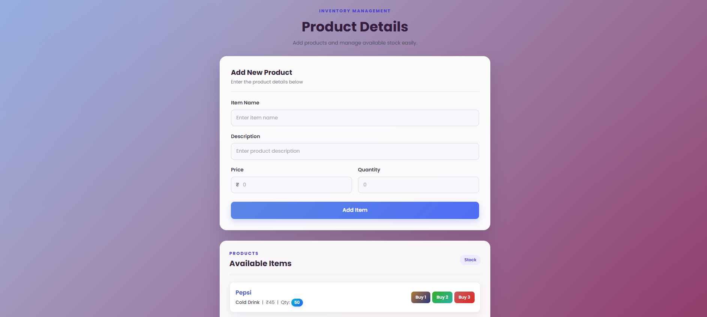

# 🛒 Inventory Management App

A simple full-stack Inventory Management web application built using HTML, CSS, JavaScript, Axios, Node.js, Express.js, Sequelize, and MySQL.

The application allows users to add products, view available products, and update their stock quantity using Buy buttons.

Product data is stored permanently in a MySQL database through a Node.js and Express.js backend.

---

## 🚀 Features

- Add new products
- Display all products from the database
- Persistent product data using MySQL
- Buy 1, Buy 2, and Buy 3 functionality
- Update product quantity
- Prevent buying when sufficient quantity is not available
- Uses Axios for API requests
- REST API using Node.js and Express.js
- Database management using Sequelize ORM
- Responsive and modern UI
- Gradient-based styling with hover effects

---

## 🛠️ Technologies Used

### Frontend

- HTML5
- CSS3
- JavaScript
- Axios

### Backend

- Node.js
- Express.js
- Sequelize
- MySQL
- CORS

---

## 📸 Preview

---

## 📁 Project Structure

Inventory-Management
│
├── frontend
│   ├── index.html
│   ├── style.css
│   └── index.js
│
└── backend
    ├── app.js
    │
    ├── controllers
    │   └── itemController.js
    │
    ├── models
    │   └── items.js
    │
    ├── routes
    │   └── itemRoutes.js
    │
    └── utils
        └── db-connection.js

---

## ⚙️ How It Works

### Add Product

The user enters:

- Item Name
- Description
- Price
- Quantity

After clicking Add Item, the frontend sends the product details to the backend using Axios.

The backend stores the product in the MySQL database using Sequelize.

---

### Display Products

When the page loads, the frontend sends a GET request to the backend.

The backend fetches all products from the MySQL database and sends them back to the frontend.

The products are then displayed on the screen.

Since the products are stored in MySQL, they remain available even after refreshing the page.

---

### Buy Buttons

Each product has three buttons:

- Buy 1
- Buy 2
- Buy 3

When a button is clicked:

1. The application checks whether enough quantity is available.
2. The required quantity is deducted.
3. The new quantity is sent to the backend.
4. The backend updates the MySQL database.
5. The updated quantity is displayed on the screen without refreshing the page.

For example:

Available Quantity: 10

Buy 2

New Quantity: 8

If the available quantity is less than the requested amount, the application displays:

"Not enough quantity available. Contact the shopkeeper!"

---

## 🌐 API Endpoints

| Method | Endpoint | Purpose |
|--------|----------|---------|
| POST | /item/add-item | Add a new product |
| GET | /item/get-items | Get all products |
| PUT | /item/update-quantity/:id | Update product quantity |

---

## 🗄️ Database

The application uses MySQL for storing product information.

Create the database using:

CREATE DATABASE product_app;

The Items table is created automatically by Sequelize when the backend starts.

### Product Fields

| Field | Type | Description |
|-------|------|-------------|
| id | INTEGER | Primary key |
| itemName | STRING | Product name |
| description | STRING | Product description |
| price | INTEGER | Product price |
| quantity | INTEGER | Available stock |

---

# ▶️ Run Locally

## 1. Clone the Repository

git clone https://github.com/your-username/Inventory-Management.git

---

## 2. Navigate to the Project

cd Inventory-Management

---

## 3. Create MySQL Database

Open MySQL and run:

CREATE DATABASE product_app;

---

## 4. Setup Backend

Navigate to the backend folder:

cd backend

Initialize Node.js:

npm init -y

Install the required packages:

npm install express sequelize mysql2 cors

---

## 5. Configure MySQL Connection

Open:

backend/utils/db-connection.js

Update your MySQL password:

const sequelize = new Sequelize(
    'product_app',
    'root',
    'YOUR_PASSWORD',
    {
        host: 'localhost',
        dialect: 'mysql'
    }
);

Replace YOUR_PASSWORD with your MySQL password.

---

## 6. Start the Backend

Inside the backend folder, run:

node app.js

The server will run at:

http://localhost:3000

You should see messages similar to:

Connection to the database has been created
Database is synced
Server running at http://localhost:3000

---

## 7. Open the Frontend

Open:

frontend/index.html

in your browser.

Make sure the backend server and MySQL are running while using the application.

---

# 🔄 Application Flow

The application follows this flow:

User
  ↓
Frontend
  ↓
Axios
  ↓
Express API
  ↓
Routes
  ↓
Controller
  ↓
Sequelize
  ↓
MySQL Database

---

## Adding a Product

Add Item
   ↓
POST /item/add-item
   ↓
Express Route
   ↓
Item Controller
   ↓
Sequelize
   ↓
MySQL

---

## Getting Products

Page Loads
   ↓
GET /item/get-items
   ↓
Express Route
   ↓
Item Controller
   ↓
Sequelize
   ↓
MySQL
   ↓
Products displayed on frontend

---

## Updating Quantity

Buy 1 / Buy 2 / Buy 3
   ↓
PUT /item/update-quantity/:id
   ↓
Express Route
   ↓
Item Controller
   ↓
Sequelize
   ↓
MySQL
   ↓
Updated quantity displayed

---

# 📌 Important Notes

- The application no longer uses CRUD CRUD.
- No CRUD CRUD API key is required.
- Product data is stored in MySQL.
- The backend must be running for the frontend to communicate with the database.
- Make sure MySQL is running before starting the backend.
- Update the MySQL password in db-connection.js.
- The frontend communicates with the backend using:

http://localhost:3000

- Axios is used for communication between the frontend and backend.
- Sequelize is used to communicate with the MySQL database.
- Sequelize automatically creates the Items table when the backend starts.

---

# 🎯 Future Improvements

- Delete Product
- Edit Product
- Search Products
- Product Categories
- Sorting and Filtering
- Low Stock Notifications
- Better Stock Management
- User Authentication
- Product Images
- Order Management
- Sales Tracking
- Dashboard with Inventory Statistics

---

# 📚 Learning Objectives

This project helps demonstrate:

- Creating a frontend using HTML, CSS, and JavaScript
- Sending API requests using Axios
- Creating a REST API using Express.js
- Organizing backend code using Routes and Controllers
- Connecting Node.js with MySQL
- Using Sequelize ORM
- Creating and querying database tables
- Updating database records
- Connecting frontend and backend
- Managing inventory quantity through APIs

---

# 👨‍💻 Author

Akshat Jain

GitHub: https://github.com/AkshatJain16